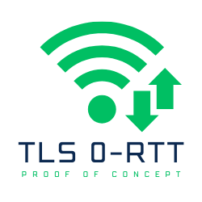

# TLS 0-RTT PoC
> Proof of concept of a reply attack against TLS 0-RTT

## Table of contents

- [What is TLS 0-RTT](#what-is-tls-0-rtt)
- [Usage](#usage)
- [License](#license)
- [Credits](#credits)

## What is TLS 0-RTT

TBD

## Usage

We'll see.

`cd sslyze`

`python -m venv venv`

`. venv/bin/activate`

`pip install sslyze`

`sslyze --early-data localhost`

`sudo tcpdump "tcp port 443" -i lo -w tls.pcap`

## License

TLS 0-RTT PoC is licensed under the terms of the GNU Affero General Public License version 3.

## Credits

The Docker configuration is loosely based on [this one](https://github.com/stevenliebregt/docker-compose-lemp-stack).