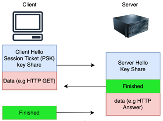
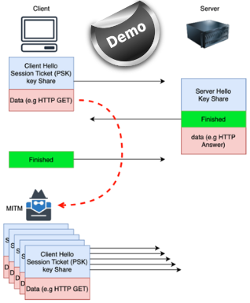
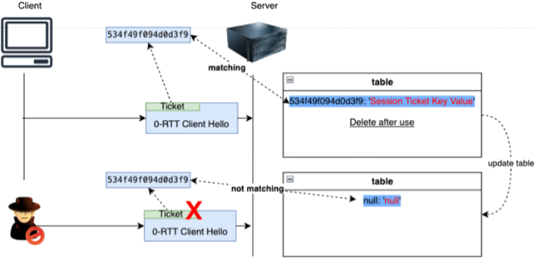
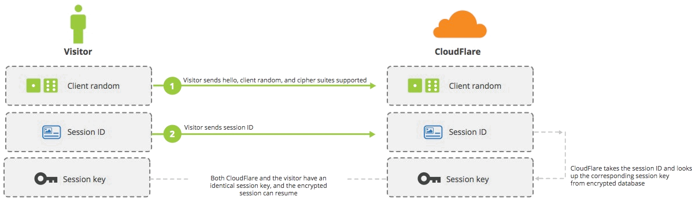

<!-- _paginate: skip -->
<!-- _backgroundImage: url('background_1st.png') -->
<!-- _header: . -->
 
 
 

<h1 style="color: #ffde59; font-size: 200%; text-shadow: 2px 2px #333">Replay Attack in TLS 1.3 0-RTT Handshake: Countermeasure Techniques</h1>

<table style="width: 100%">
<tr style="background-color: rgba(0, 0, 0, 0); border: none">
<td style="width: 60%; border: none; color: white; font-weight: bold; text-shadow: 2px 2px #333;">
Network Security (933II) 
M.Sc. Cybersecurity 
Paolo Bernardi (660944) 
 
Version: 1.0
</td>
<td style="width: 40%; border: none">

</td>
</tr>
</table>

---

# The Paper

  - **Conference:** 2023 IEEE 6th International Conference on Electrical, Electronics and System Engineering (ICEESE)
  - **Authors:** M.E Abdelhafez (Malaysia), Sureswaran Ramadass (Malaysia), Mohammed S. M. Gismallab (Saudi Arabia)
  - **Goal:** review anti-replay protection techniques
  - **Keywords:** TLS 1.3, replay attack, 0-RTT, handshake

---

# Context

<table style="width: 100%">
<tr style="background-color: rgba(0, 0, 0, 0); border: none">
<td style="width: 60%; border: none">
<ul>
<li>TLS resumable connections</li>
<li>TLS 1.3 introduced <strong>0-RTT</strong> resume mode, based on a <strong>Session-Ticket key</strong> created during the initial full handshake</li>
<li>0-RTT obtained by sending a <strong>single message</strong> that contains both the <strong>ClientHello</strong> (with a known Session-Ticket key) and <strong>Application Data</strong> (also known as <strong>Early Data</strong>)</li>
</ul>
</td>
<td style="width: 40%; border: none">

</td>
</tr>
</table>

---

# Attack Scenarios

<table style="width: 100%">
<tr style="background-color: rgba(0, 0, 0, 0); border: none">
<td style="width: 60%; border: none">
<ul>
<li><strong>Replay</strong> attack</li>
<li>Attacker intercepts and replays <strong>ClientHello</strong> messages with <strong>Early Data</strong></li>
<li>The replayed message is valid because the <strong>ClientHello</strong> contains a <strong>Session-Ticket key</strong> recognized by the server</li>
<li><strong>ALTERNATIVE SCENARIO:</strong> the attacker performs a <strong>MITM</strong> and makes the client <strong>to believe that the 0-RTT message wasn't received</strong>, triggering a resending
</ul>
</td>
<td style="width: 40%; border: none">

</td>
</tr>
</table>

---

# Freshness check

Reject **ClientHello** messages whose **gmt_unix_time** too much in the past

  - **PROS:** simple implementation
  - **CONS:** can be inconvenient and there is an exploitable time window for attackers

# ClientHello Recording

The server keeps a list of received **ClientHello** messages and uses it to detect and discard replays 

  - **PROS:** can block all replay attacks
  - **CONS:** complex setup in distributed environments

---

# Single-Use Tickets

The server **deletes** the "session ticket key" used to decrypt the early data after the first 0-RTT resume, making it impossible to decrypt replayed messages.
  - **PROS:** prevents 100% of replay attacks
  - **CONS:** requires synchronization between nodes in distributed environments

---

# Application Profile

Each application should implement a specific **profile** that specifies under which conditions it will use 0-RTT (e.g. HTTP GET).
  - **PROS:** flexibility
  - **CONS:** not 100% safe, requires intervention at application level

# Separate API

Both client and servers use libraries that make 0-RTT usage **explicit**, rather than implicit and automatic.
  - **PROS:** explicit behaviour
  - **CONS:** requires TLS libs restructuring and programmers attention

---

# Puncture Pseudorandom Function (PPRF)

By using **PPRF** the server can decrypt 0-RTT early data only once.

**Example approach:** a server maintains a session ticket encryption key (STEK) *k* that can decrypt any session ticket. Then it uses it to decrypt a ticket *t* and it generates a STEK *k'* that can decrypt all session tickets but *t* and so on...

  - **PROS:** forward secrecy
  - **CONS:** long processing time, cannot be used in distributed environments

---

# Universal SSL

Introduced by **Cloudflare** in 2015 (doesn't support TLS 1.3), Universal SSL stores negotiated sessions into multiple **Memcached** instances. Each session is indexed and encrypted by **Session ID**.

  - **PROS:** great performance
  - **CONS:** Memcached servers are synchronized only within each  Cloudflare PoP

---

# Just-in-Time Shared Keys (JIT-SK)

Based on a **synchronized PRNG**, dynamically changes keys for each session to secure 0-RTT messages (the same key cannot be reused multiple times, so "blind replaying" is impossible)
  - **PROS:** prevents replay attacks and provides **forward secrecy**
  - **CONS:** doesn't support distributed environments

---

# Conclusions

  - **0-RTT is here to stay**: the performance improvements are real (the paper stats that 0-RTT resume is 44.7% than 1-RTT) and the percentage of resumed TLS connections is also quite high (40% ins some applications)
  - **0-RTT anti-reply protection requires trade offs:** the evaluated protections introduce overheads and/or inconveniences, especially in distributed environments (e.g. CDNs), therefore 0-RTT replay protection is still an open research topic

---
<!-- _paginate: skip -->
<!-- _backgroundImage: url('background_thanks.png') -->
<!-- _header: . -->

